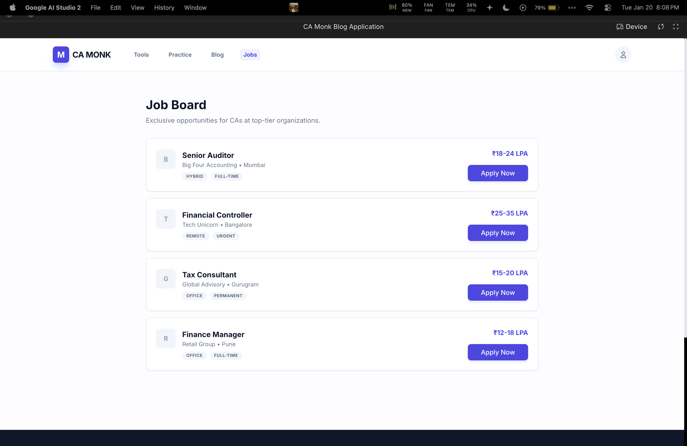

# CA Monk 📚

A modern, full-featured blog and resource platform designed specifically for **Chartered Accountants (CAs)** and finance professionals. Built with React, TypeScript, and Vite for a blazing-fast, responsive user experience.


---

## 📋 Table of Contents

- [Features](#-features)
- [Screenshots](#-screenshots)
- [Tech Stack](#-tech-stack)
- [Project Structure](#-project-structure)
- [Getting Started](#-getting-started)
  - [Prerequisites](#prerequisites)
  - [Installation](#installation)
  - [Running the App](#running-the-app)
- [Configuration](#-configuration)
- [API Reference](#-api-reference)
- [Contributing](#-contributing)
- [License](#-license)

---

## ✨ Features

### 📝 Blog Management

- **Create, Read, and Browse** blog articles with a clean, modern interface
- **Category-based filtering** (Finance, Tech, Career, Regulations, Skills, Taxation, Development)
- **AI-powered content** generation using Google Gemini API
- **Offline support** with LocalStorage fallback when backend is unavailable

### 🧮 Financial Tools

- **Income Tax Calculator** (FY 24-25) with instant calculations
- **GST Portal** quick access integration
- **Audit Checklists** for statutory and internal audits

### 📖 Practice Arena

- Real-world scenarios and mock tests
- Skill-level based challenges for CA exam preparation

### 💼 Jobs Section

- Job listings and career opportunities for finance professionals

### 👤 User Profile

- Personalized profile management
- Activity tracking and preferences

---

## 📸 Screenshots

| Home / Blog List                   | Blog Detail                            |
| ---------------------------------- | -------------------------------------- |
|  |  |

| Financial Tools            | Practice Arena                   |
| -------------------------- | -------------------------------- |
|  |  |

| Create Article                       |
| ------------------------------------ |
|  |

---

## 🛠 Tech Stack

| Technology            | Purpose                           |
| --------------------- | --------------------------------- |
| **React 19**          | UI Library                        |
| **TypeScript**        | Type-safe JavaScript              |
| **Vite**              | Build tool & dev server           |
| **TanStack Query**    | Server state management & caching |
| **Google Gemini API** | AI-powered content generation     |
| **Tailwind CSS**      | Utility-first styling             |
| **LocalStorage**      | Offline data persistence          |

---

## 📁 Project Structure

```
CA-Monk-main/
├── App.tsx                 # Main application component with routing
├── index.tsx               # Application entry point
├── index.html              # HTML template
├── types.ts                # TypeScript type definitions
├── vite.config.ts          # Vite configuration
├── tsconfig.json           # TypeScript configuration
├── package.json            # Dependencies and scripts
│
├── components/
│   ├── BlogList.tsx        # Blog listing component
│   ├── BlogDetail.tsx      # Individual blog view
│   ├── BlogForm.tsx        # Create/Edit blog form
│   ├── FeatureViews.tsx    # Tools, Practice, Jobs, Profile views
│   └── ui-mock.tsx         # Reusable UI components (Button, Card, etc.)
│
├── services/
│   └── api.ts              # API layer with mock data fallback
│
└── Images/                 # Application screenshots
```

---

## 🚀 Getting Started

### Prerequisites

- **Node.js** (v18 or higher recommended)
- **npm** or **yarn** package manager
- **Google Gemini API Key** (optional, for AI features)

### Installation

1. **Clone the repository**

   ```bash
   git clone git@github.com:MohdAltamish/CA-Monk.git
   cd CA-Monk
   ```

2. **Install dependencies**
   ```bash
   npm install
   ```

### Running the App

**Development mode:**

```bash
npm run dev
```

The app will be available at `http://localhost:5173`

**Build for production:**

```bash
npm run build
```

**Preview production build:**

```bash
npm run preview
```

---

## ⚙️ Configuration

### Environment Variables

Create a `.env.local` file in the root directory:

```env
GEMINI_API_KEY=your_gemini_api_key_here
```

| Variable         | Description                           | Required |
| ---------------- | ------------------------------------- | -------- |
| `GEMINI_API_KEY` | Google Gemini API key for AI features | Optional |

### Backend Configuration

The app connects to a backend API at `http://localhost:3001`. If the backend is unavailable, it automatically falls back to:

- **Mock data** for initial blog posts
- **LocalStorage** for user-created content

---

## 📡 API Reference

### Blogs

| Method | Endpoint     | Description               |
| ------ | ------------ | ------------------------- |
| `GET`  | `/blogs`     | Fetch all blog posts      |
| `GET`  | `/blogs/:id` | Fetch a single blog by ID |
| `POST` | `/blogs`     | Create a new blog post    |

### Blog Object Schema

```typescript
interface Blog {
  id: number;
  title: string;
  category: string[]; // e.g., ["FINANCE", "TECH"]
  description: string;
  date: string; // ISO date string
  coverImage: string; // URL to cover image
  content: string; // Blog content (supports markdown)
}
```

### Categories

Available categories: `FINANCE`, `TECH`, `CAREER`, `REGULATIONS`, `SKILLS`, `TAXATION`, `DEVELOPMENT`

---

## 🤝 Contributing

Contributions are welcome! Please follow these steps:

1. **Fork** the repository
2. **Create** a feature branch (`git checkout -b feature/amazing-feature`)
3. **Commit** your changes (`git commit -m 'Add amazing feature'`)
4. **Push** to the branch (`git push origin feature/amazing-feature`)
5. **Open** a Pull Request

### Development Guidelines

- Follow TypeScript best practices
- Use functional components with hooks
- Write meaningful commit messages
- Test your changes before submitting

---

## 📄 License

This project is open source and available under the [MIT License](LICENSE).

---

## 👨‍💻 Author

**Mohd Altamish**

- GitHub: [@MohdAltamish](https://github.com/MohdAltamish)

---

<p align="center">
  Made with ❤️ for the CA community
</p>
